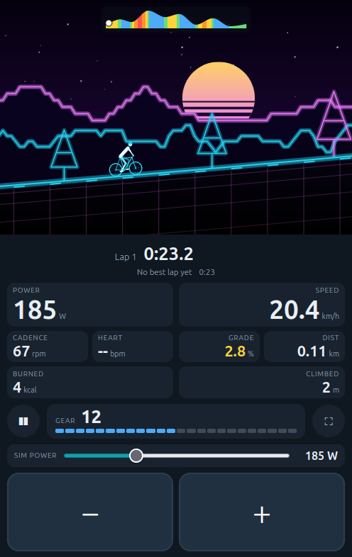
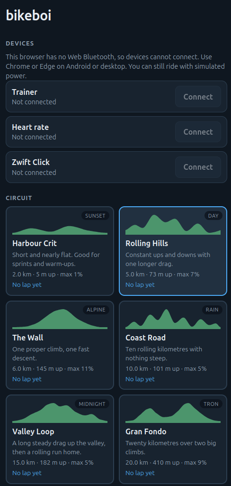
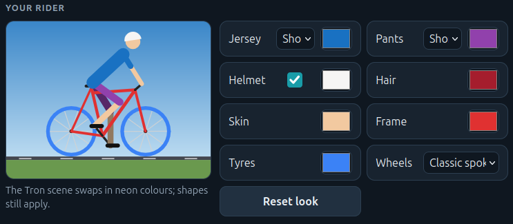
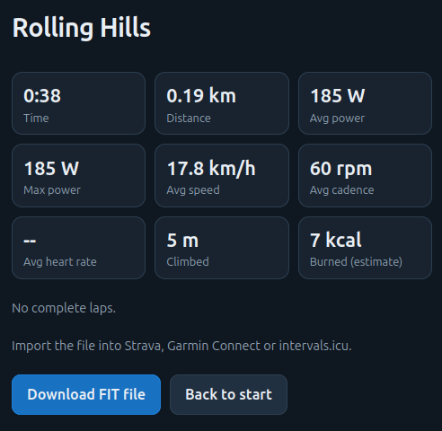
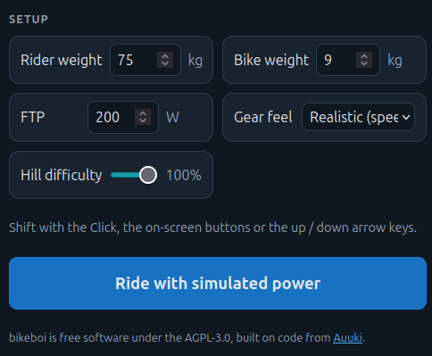
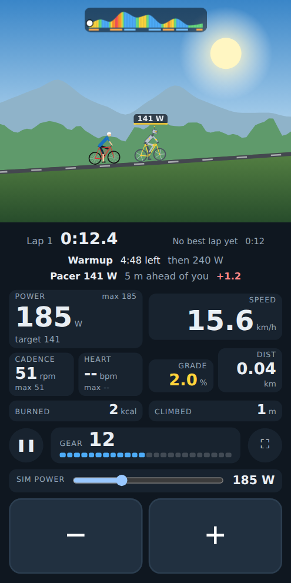

# bikeboi

A side-scrolling circuit game for smart bike trainers, in the browser. Ride laps of a
circuit, chase a ghost of your best lap, shift virtual gears with a Zwift Click (v1), the
on-screen buttons or the arrow keys, and download a FIT file at the end.

Needs a browser with Web Bluetooth (Chrome or Edge on Android or desktop). Without a
trainer it runs with simulated power.

<p align="center">
  
  &nbsp;
  
</p>

## Screenshots

| | |
| --- | --- |
| **Customise your rider**<br> | **Ride summary and FIT download**<br> |
| **Setup**<br> | **Robot pacemaker and workouts**<br> |

## Run

```sh
bun install
bun run dev        # Vite dev server, http://localhost:3000
bun run dev:api    # the API (accounts, sync, rides) on :3071, proxied by Vite; database in data/dev.db
bun test
bun run typecheck  # vue-tsc
bun run build      # static site in dist/
```

The UI is Vue 3 single-file components (`src/ui/*.vue`, `src/App.vue`) built with Vite;
everything else is plain TypeScript, and the game logic never depends on Vue.

Web Bluetooth only works on `localhost` or HTTPS. To use a phone against the dev server,
expose it over HTTPS, for example `cloudflared tunnel --url http://localhost:3000` or
`tailscale serve 3000`.

On Linux desktop Chrome, Web Bluetooth may need
`chrome://flags/#enable-experimental-web-platform-features`.

## Backend

`server.ts` serves the built site and a JSON API (`server/`): email + password accounts,
and per-user settings, best laps and segment bests, workouts and ride files, all in one
SQLite database (`bun:sqlite`, WAL). The app works fully without an account; signing in
syncs those things between devices (`src/sync/`) and keeps a ride history (`#rides`).
There is no password-reset email: on the server, `DB_PATH=data/bikeboi.db bun server/cli.ts
reset-password <email>` sets a new one. `deploy/backup.sh` runs nightly from a systemd
timer and keeps 14 days of gzipped copies in `backups/`.

## Deploy

`bun run deploy` (or `deploy/deploy.sh [ssh-host] [path]`) runs the tests and typecheck, builds, copies
`dist/`, `server.ts` and `deploy/` to the server and restarts the `bikeboi` systemd user
service. The reverse-proxy block is in `deploy/Caddyfile`.

The build names scripts and styles after their content, and `server.ts` sends them with
a one-year immutable cache header and the HTML with `no-cache`, so a CDN in front never
serves an old release.

## Controls

| Action | Keys | Other |
| --- | --- | --- |
| Harder / easier gear | Up / Down, `+` / `-` | on-screen buttons, Zwift Click |
| Pause | Space | pause button, switching away from the tab |
| Simulated power | Left / Right | slider (only without a trainer) |

Dev switches, honoured only on localhost (`src/dev.ts`): `?timescale=20` fast-forwards
simulated rides; `?count=1` makes a simulated ride count like a real one (bests kept,
saved to the account), so the real-ride paths can be tested without a trainer.

The app has an About page (`#about`, `src/ui/about.ts`) built from the screenshots in
`img/`; first-time visitors get a one-time card pointing to it.

## Circuits and scenes

Six circuits from 2 to 20 km (`src/ride/circuits/index.ts`), each with a default scene.
The scene can be overridden on the home screen: Day, Sunset, Alpine, Rain, Midnight, Tron
(`src/game/scenes.ts`).

Climbs and descents are found from each circuit's profile and timed as segments, with a
personal best per segment (`src/ride/segments.ts`); sprints are placed by hand in the
circuit definition.

A pacemaker (`src/ride/pacer.ts`) is a second run of the same simulation, stepped on the
rider's clock, at fixed watts or following a workout; the ride screen shows the gap in
metres and seconds. The pacemaker is drawn as a robot
(`drawRobotFigure` in `src/game/rider.ts`). In hard mode the trainer is sent power targets
(ERG) instead of gradients and the shift buttons scale the session; this is untested on
real hardware. Workouts use the intervals.icu workout-builder text format
(`src/ride/workout.ts` documents what is supported); built-ins and the rider's own are in
`src/ride/workouts.ts`.

The rider is customisable on the home screen (helmet, hair, skin, jersey, pants, frame,
tyres, wheel style); the look lives in `src/game/rider.ts`.

A ride is autosaved every second. If the tab dies, the start screen offers to resume it
(`src/ride/resume.ts` rebuilds the state from the saved samples) or to save the FIT file.

Calories are an estimate from pedalling work, assuming 24 % gross efficiency
(`src/ride/energy.ts`).

## How gears work

Road speed comes from your power, the gradient and your weight; gears never change it.
A gear only changes the gradient the trainer is told to simulate, so a harder gear means
more resistance at the same cadence. "Realistic" uses a force-balance model
(`src/ride/gears.ts`); "Simple" adds a fixed gradient step per gear.

## Layout

- `src/ride/` simulation, circuits, gears, ghost, recorder
- `src/game/` canvas renderer
- `src/ble/` trainer / heart-rate / Click device layer
- `src/ui/` screens as Vue components; `ride-controller.ts` runs the ride and publishes a
  view-model that `RideScreen.vue` renders
- `src/vendor/auuki/` Bluetooth, physics and FIT code borrowed from
  [Auuki](https://github.com/dvmarinoff/Auuki); see the README there for what was changed

## Licence

AGPL-3.0, like Auuki. If you host a modified version, you must offer its source to the
people using it; point `SOURCE_URL` in `src/ui/home.ts` at your repository.
